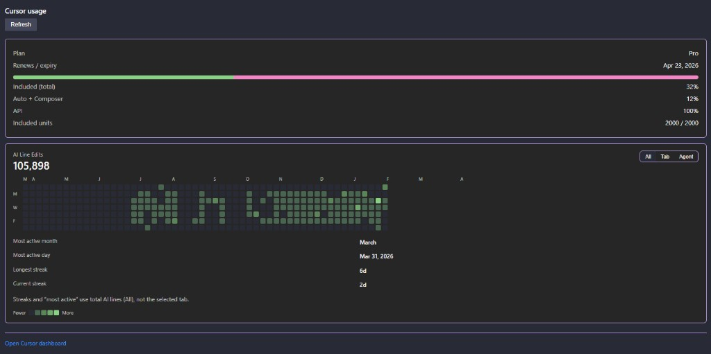

# Cursor Limits

VS Code / **Cursor** extension that reads your session from Cursor’s local SQLite database and calls Cursor’s dashboard HTTP APIs to show **Fast / Premium** usage in the **status bar**, with a progress bar, color thresholds, and a detailed hover tooltip.

## Extension Overview

## Dashboard Panel

## Disclaimer

This extension uses **undocumented** storage keys and `cursor.com` routes that may change at any time. It may **stop working** after a Cursor update. See [SECURITY.md](SECURITY.md) for what is read and where requests go, and [POLICY.md](POLICY.md) before publishing or redistributing.

Tested on **macOS** and **Windows**. Linux should work if Cursor stores data under the usual `~/.config/Cursor/...` layout.

## Features

- **Minimal setup**: Reads `cursorAuth/accessToken` from Cursor’s `state.vscdb` using **[sql.js](https://github.com/sql-js/sql.js)** (SQLite in WebAssembly). No system `sqlite3` CLI is required, so **Windows works out of the box** (macOS/Linux often had `sqlite3` on `PATH` before; this approach is consistent everywhere).
- **Color coding**: Warning near high usage, error color at very high usage.
- **Progress bar**: ASCII bar in the status text.
- **Tooltip**: Premium vs Auto/Composer-style breakdown when available from the API.
- **Dashboard panel**: Clicking the extension status bar item (or running the command) opens the in-editor Cursor usage dashboard panel.
- **Quick links**: The panel includes links to open the Cursor dashboard and spending page in your browser.

## Requirements

- **Cursor** (or a VS Code build where Cursor’s data paths apply) with a logged-in account.
- No extra system tools: the extension bundles **sql.js** to read the local SQLite file.

## Install

### From a VSIX (local or CI artifact)

1. Run `npm install` and `npm run compile`, then `npm run vsix` to produce `cursor-limits-<version>.vsix` (version from `package.json`).
2. In Cursor: **Extensions** → **…** → **Install from VSIX…** and select the file.

### Open VSX (published)

- `cursor-limits` is published on Open VSX: [naumanmoazzam/cursor-limits](https://open-vsx.org/extension/naumanmoazzam/cursor-limits)

## Development

1. `npm install`
2. `npm run compile` (or `npm run watch`)
3. Open this folder in Cursor/VS Code and press **F5** (Extension Development Host).

See [CONTRIBUTING.md](CONTRIBUTING.md) for guidelines.

## Security and policy

- [SECURITY.md](SECURITY.md) — data access and reporting issues.
- [POLICY.md](POLICY.md) — marketplace and terms-of-use checklist for maintainers.

## License

MIT — see [LICENSE](LICENSE).
