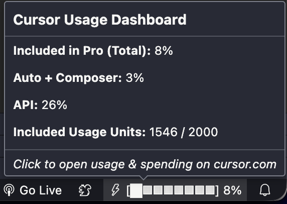

# Cursor Limits

VS Code / **Cursor** extension that reads your session from Cursor’s local SQLite database and calls Cursor’s dashboard HTTP APIs to show **Fast / Premium** usage in the **status bar**, with a progress bar, color thresholds, and a detailed hover tooltip.

## Extension Overview



## Disclaimer

This extension uses **undocumented** storage keys and `cursor.com` routes that may change at any time. It may **stop working** after a Cursor update. See [SECURITY.md](SECURITY.md) for what is read and where requests go, and [POLICY.md](POLICY.md) before publishing or redistributing.

## Features

- **Minimal setup**: Reads `cursorAuth/accessToken` from Cursor’s `state.vscdb` via the system `sqlite3` binary (no manual token copy).
- **Color coding**: Warning near high usage, error color at very high usage.
- **Progress bar**: ASCII bar in the status text.
- **Tooltip**: Premium vs Auto/Composer-style breakdown when available from the API.
- **Dashboard**: Command / click opens Cursor’s spending dashboard in the browser.

## Requirements

- **Cursor** (or a VS Code build where Cursor’s data paths apply) with a logged-in account.
- **`sqlite3`** available on your `PATH` (macOS/Linux often have it; on Windows install SQLite or ensure `sqlite3.exe` is on `PATH`).

## Install

### From a VSIX (local or CI artifact)

1. Run `npm install` and `npm run compile`, then `npm run vsix` to produce `cursor-limits-0.0.1.vsix` (version from `package.json`).
2. In Cursor: **Extensions** → **…** → **Install from VSIX…** and select the file.

### From a marketplace (when published)

After the extension is published under publisher `naumanmoazzam`, install from the Extensions view or use your editor’s CLI, for example:

```bash
code --install-extension naumanmoazzam.cursor-limits
```

Use the equivalent command for **Cursor** if documented (publisher and extension id may match the marketplace listing).

**Note:** Primary distribution for extensions is the **Visual Studio Marketplace** and/or **Open VSX**, not `npm install` as an app installer. This repo is not published as a general-purpose npm library.

### Publishing to a marketplace (maintainers)

1. **Build**: `npm install`, `npm run compile`, `npm run vsix` (sanity-check the `.vsix`).
2. **Visual Studio Marketplace**: Create a [publisher](https://code.visualstudio.com/api/working-with-extensions/publishing-extension), install `@vscode/vsce`, then `vsce login` / `vsce publish` with a [Personal Access Token](https://code.visualstudio.com/api/working-with-extensions/publishing-extension#publishing-extensions).
3. **Open VSX** (optional, e.g. some VS Code forks): Follow [Publishing Extensions](https://github.com/eclipse/openvsx/wiki/Publishing-Extensions) and use `npx ovsx publish` after obtaining a token.

Publishing requires your own accounts and tokens; this repository does not store secrets.

## Development

1. `npm install`
2. `npm run compile` (or `npm run watch`)
3. Open this folder in Cursor/VS Code and press **F5** (Extension Development Host).

See [CONTRIBUTING.md](CONTRIBUTING.md) for guidelines.

## Security and policy

- [SECURITY.md](SECURITY.md) — data access and reporting issues.
- [POLICY.md](POLICY.md) — marketplace and terms-of-use checklist for maintainers.

## License

MIT — see [LICENSE](LICENSE).
